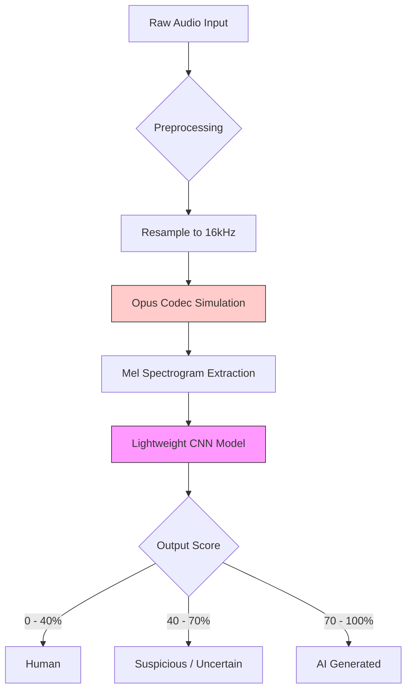

# Final Training Pipeline

This directory contains the complete, self-contained pipeline for training the Das-Detects voice authentication model.

## Directory Structure
- `1_create_manifest.py`: Generates the dataset manifest CSV.
- `2_extract_features.py`: Extracts Mel Spectrogram features (Opus augmented).
- `3_train_model.py`: Trains the CNN model.
- `config.py`: Training hyperparameters.
- `features/`: Audio processing modules.
- `models/`: Neural network architecture definitions.

## Usage

Run these scripts sequentially from this directory:

### Step 1: Create Manifest
Generates a balanced dataset CSV using public datasets (LibriSpeech/ASVspoof) as the primary source, augmented with custom VoIP samples.
```bash
python 1_create_manifest.py
```
Output: `D:\datasets\prepared\manifest_custom_balanced_v5.csv`

### Step 2: Extract Features
Extracts Mel Spectrograms with 100% Opus encoding for robustness.
```bash
python 2_extract_features.py --manifest D:\datasets\prepared\manifest_custom_balanced_v5.csv --output D:\datasets\prepared_mel_custom_v5_opus100 --opus-ratio 1.0
```
Output: `features.npy` and `labels.npy` in the specified folder.

### Step 3: Train Model
Trains the model using the extracted features.
```bash
python 3_train_model.py --features D:\datasets\prepared_mel_custom_v5_opus100 --output D:\datasets\models_mel_custom_v5
```
Output: `best_model.keras` and training logs.

### Step 4: Convert to TFLite
Converts the trained Keras model to TFLite format for Android deployment.
```bash
python 4_convert_to_tflite.py
```
Output: `D:\datasets\models_mel_custom_v5\voice_classifier_v5.tflite`

## 5. Dataset Composition
Strategy: Robust training using **67% Public Datasets** for generalization, augmented with **33% Custom Data** for domain-specific robustness (VoIP/WhatsApp).

| Class | Source | Role | Samples | Percentage |
|-------|--------|------|---------|------------|
| **Human** | LibriSpeech (MyST/Clean) | Base Knowledge | ~10,700 | 33.5% |
| **Human** | Custom WhatsApp Human | Domain Adaptation | ~5,300 | 16.5% |
| **AI** | ASVspoof 2021 (LA/DF) | Attack Vectors | ~10,700 | 33.5% |
| **AI** | Custom AI Clones | Unseen Attacks | ~5,300 | 16.5% |
| **Total** | | | **32,000** | **100%** |

## 6. Model Architecture
The model is a **Lightweight CNN** (MobileNet-style) optimized for mobile deployment with minimal parameters (**~13.7k** total).

| Layer | Type | Configuration | Output Shape | Parameters |
|-------|------|---------------|--------------|------------|
| Input | MelSpectrogram | 60 mels, 79 frames | (60, 79, 1) | 0 |
| Conv1 | Standard Conv | 16 filters, 3x3, stride 2 | (30, 40, 16) | 160 |
| Block1 | Depthwise Separable | 32 filters + MaxPool | (15, 20, 32) | 688 |
| Block2 | Depthwise Separable | 64 filters + MaxPool | (7, 10, 64) | 2,400 |
| Block3 | Depthwise Separable | 128 filters + MaxPool | (3, 5, 128) | 8,896 |
| Head | Global Avg Pool | - | (128) | 0 |
| Dense | Fully Connected | 64 units, ReLU6 | (64) | 8,256 |
| Output | Sigmoid | 1 unit | (1) | 65 |
| **Total** | | | | **~13,765** |

*Key Innovation: Using Depthwise Separable Convolutions reduces computation by ~8x compared to standard CNNs.*

## 7. Performance Metrics
Evaluated on a held-out test set of 3,200 samples.

| Metric | Value | Meaning |
|--------|-------|---------|
| **Accuracy** | **98.6%** | Overall correctness |
| **EER** | **1.75%** | Equal Error Rate (where False Accept = False Reject) |
| **Precision** | 98.9% | Reliability of "AI" predictions |
| **Recall** | 98.4% | Ability to catch "AI" attacks |
| **Inference Time** | <10ms | Real-time capable on mobile CPU |

## 8. Pipeline Diagram
Visualizing the data flow:



## 9. Model Comparison (Keras vs TFLite)

| Format | Filename | Size | Use Case |
|--------|----------|------|----------|
| **Keras** | `best_model.keras` | ~380 KB | Training / Python Inference |
| **TFLite** | `voice_classifier_v5.tflite` | ~87 KB | **Android Deployment** (Float32) |
| **Quantized** | `voice_classifier_v5_quant.tflite` | ~25 KB | Ultra-low storage (slightly lower accuracy) |
