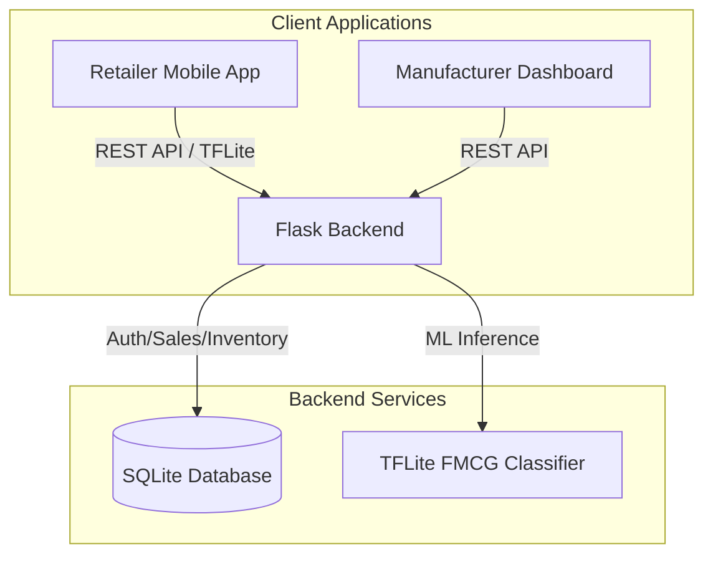

# Reco: Smart FMCG Inventory & Sales Management

Reco is an end-to-end solution designed to streamline inventory management and sales tracking for retailers while providing deep market insights for manufacturers. By leveraging real-time product recognition and advanced analytics, Reco bridges the gap between the storefront and the production line.

---

## 🏗️ Architecture Overview

Reco consists of three primary components interacting through a centralized Flask backend:



---

## 📱 Retailer Mobile App (React Native)
The mobile app empowers small to medium-scale retailers with high-tech tools for daily operations.

### Key Features:
- **Real-time Product Recognition**: Integrated TensorFlow Lite model identifies FMCG products instantly through the camera feed.
- **Dynamic Feedback**: Bounding boxes provide visual confirmation (green highlight) on successful identification.
- **Inventory Management**: Track stock levels, add new products, and receive low-stock alerts.
- **Sales & Digital Receipts**: Streamlined checkout process with QR code generation and the ability to print or share digital receipts.
- **Analytics Dashboard**: View daily sales trends, revenue forecasts, and top-performing categories.

---

## 🌐 Manufacturer Dashboard (React Web-App)
A dedicated portal for manufacturers to monitor their product footprint and performance across the retail network.

### Key Features:
- **Market Insights**: Visualize demand patterns and stock exhaustion rates across different retailers.
- **Product Management**: Oversee the catalog of products distributed to the network.
- **Performance Analytics**: Detailed charts (via Recharts) showing sales growth and market share for specific product lines.
- **Secure Access**: Dedicated authentication flow for manufacturer accounts.

---

## ⚙️ Core Backend (Python / Flask)
A robust API layer handling data persistence, authentication, and machine learning utilities.

### Services:
- **`auth`**: Secure JWT-based authentication for both retailers and manufacturers.
- **`sales`**: Manages transaction logs, invoice generation, and sales history.
- **`inventory`**: Centralized stock management and category tracking.
- **`manufacturer`**: Specialized endpoints providing aggregated data for the manufacturer dashboard.
- **`classify`**: Server-side support and diagnostic tools for the TFLite classification model.

---

## 🛠️ Tech Stack

### Frontend & Mobile
- **Mobile**: React Native, Expo, Vision Camera, `react-native-fast-tflite`.
- **Web**: React (v18), React Router, Recharts, Axios.
- **Styling**: Vanilla CSS / Flexbox.

### Backend & Infrastructure
- **Server**: Python 3.x, Flask, Flask-CORS.
- **Database**: SQLite (SQLAlchemy / Raw SQL).
- **AI/ML**: TensorFlow Lite (Custom FMCG Model).
- **Tools**: Docker & Docker Compose support.

---

## 🚀 Getting Started

### 1. Backend Setup
```bash
cd backend
python -m venv venv
source venv/bin/activate  # or venv\Scripts\activate on Windows
pip install -r requirements.txt
python app.py
```

### 2. Mobile App Setup
```bash
# From the root directory
npm install
npx expo start
```

### 3. Manufacturer Dashboard Setup
```bash
cd web-app
npm install
npm start
```

---

